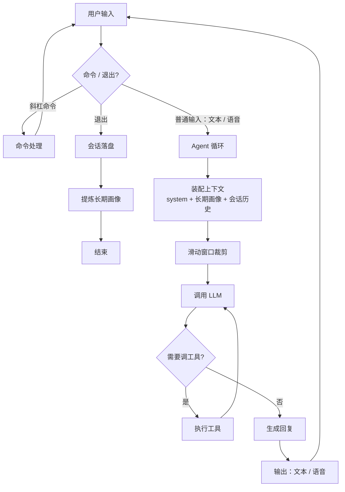

# calendar-agent

一个跑在 macOS 上、基于 OpenAI SDK 实现的执行型 AI Agent：说一句话或打一行字，它就能理解你的意图，帮你打理日程——通过系统「提醒事项」真实写入并触发原生提醒，也能联网回答天气、汇率、新闻这类实时问题。支持纯文本或纯语音两种交互，还能在远程模型和本地模型之间一键切换。


## 功能

- **日程管理**：自然语言完成提醒事项的增删改查
- **实时信息检索**：联网获取天气、汇率、新闻、营业状态等时效信息
- **多模态交互**：语音与文本输入输出自由切换，语音模式下仍支持斜杠命令
- **长期记忆**：跨会话保留用户画像并自动引用，提炼前清洗噪声，避免误记一次性日程
- **可靠的 Agent 执行**：取得工具成功返回前不声称完成；工具异常隔离，单点出错不影响整体；超步数自动兜底，防止死循环
- **上下文管理**：滑动窗口控制 token 用量，窗口大小与清空均可通过斜杠命令调整
- **模型可切换**：远程 / 本地模型一键切换，配置持久化

## 架构



## 环境要求

- Python 3.12+
- [uv](https://github.com/astral-sh/uv) 包管理器

## 快速开始

```bash
# 1. 克隆并进入项目
git clone https://github.com/yzheeng/calendar-agent
cd calendar-agent

# 2. 安装依赖
uv sync

# 3. 配置环境变量，在 .env 中填入对应 api key
cp .env.example .env

# 4. 启动
uv run main.py
```

> 首次运行时，macOS 会弹窗请求「自动化」（控制提醒事项）与「麦克风」权限，允许即可。

启动后直接打字对话，输入 `/help` 查看命令，`/voice` 切到全语音模式，`/exit` 退出。

## 配置

模型来源、输入输出模式、上下文窗口在 `settings.json` 中配置；各服务密钥（阿里云百炼、火山引擎豆包语音、Tavily 搜索）填在 `.env` 中，模板见 `.env.example`。

## 命令

| 命令 | 作用 |
| --- | --- |
| `/help` | 显示帮助 |
| `/status` | 当前模型 / 输入输出模式 |
| `/model_setting` | 进入模型配置（远程 / 本地） |
| `/input <text\|voice>` | 切换输入模式 |
| `/output <text\|voice>` | 切换输出模式 |
| `/voice` / `/text` | 一键全语音 / 全文本 |
| `/profile` | 查看当前长期偏好 |
| `/set_context <n>` | 设置上下文滑动窗口大小 |
| `/clear_context` | 清空当前会话上下文 |
| `/exit` | 退出 |

