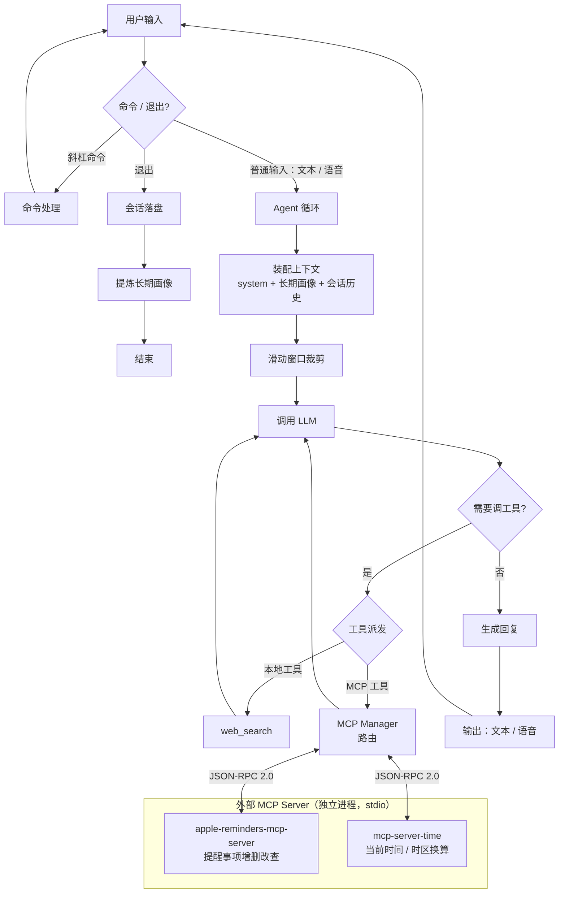
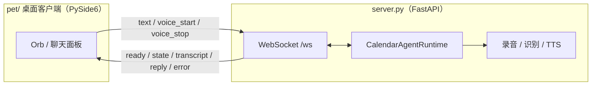

# calendar-agent

一个跑在 macOS 上、基于 OpenAI SDK 实现的执行型 AI Agent：说一句话或打一行字，它就能理解你的意图，帮你打理日程——日程能力由独立的 [apple-reminders-mcp-server](https://github.com/yzheeng/apple-reminders-mcp-server) 通过 MCP 协议提供，真实写入系统「提醒事项」并触发原生提醒；也能联网回答天气、汇率、新闻这类实时问题。支持纯文本或纯语音两种交互，还能在远程模型和本地模型之间一键切换。

可以纯终端使用，也可以启动一个 WebSocket 后端，配上桌面「宠物」GUI——一个透明置顶的小圆球，点击说话、右键切换文本 / 语音模式。

## 功能

- **日程管理**：自然语言完成提醒事项的增删改查
- **MCP 工具接入**：自带极简 MCP Host 实现（stdio + JSON-RPC 2.0），启动时动态发现工具；server 在 `settings.json` 中声明（兼容 Claude Desktop 等通用 `mcpServers` schema），新增能力无需改代码
- **实时信息检索**：联网获取天气、汇率、新闻、营业状态等时效信息
- **多模态交互**：语音与文本输入输出自由切换，语音模式下仍支持斜杠命令
- **桌面 GUI（可选）**：基于 PySide6 的悬浮 orb 桌宠，通过 WebSocket 连接后端，实时显示聆听 / 思考 / 说话状态，文本模式下是气泡式聊天面板
- **长期记忆**：跨会话保留用户画像并自动引用，提炼前清洗噪声，避免误记一次性日程
- **可靠的 Agent 执行**：取得工具成功返回前不声称完成；工具异常隔离，单点出错不影响整体；超步数自动兜底，防止死循环
- **上下文管理**：滑动窗口控制 token 用量，窗口大小与清空均可通过斜杠命令调整
- **模型可切换**：远程 / 本地模型一键切换，配置持久化

## 架构

核心是一个可复用的 `CalendarAgentRuntime`（`src/agent/runtime.py`），封装了启动、对话、命令、落盘的完整生命周期，并通过 `event_callback` 向外推送状态事件。两个入口共用同一份 runtime：

- **`main.py`**：纯终端 CLI 入口
- **`server.py`**：FastAPI + WebSocket 后端（`127.0.0.1:8765/ws`），把 runtime 暴露给桌面 GUI；`pet/` 是对应的 PySide6 桌宠客户端

### Agent 主循环



### 桌面 GUI 链路

桌宠与后端解耦：后端把 runtime 的事件（`state` / `transcript` / `tool` / `reply` / `error`）通过 WebSocket 推给前端，前端只负责渲染和采集语音/文本输入。语音录制、识别、合成都在后端完成。



## 环境要求

- macOS（提醒功能依赖系统「提醒事项」）
- Python 3.12+
- [uv](https://github.com/astral-sh/uv) 包管理器

## 快速开始

```bash
# 1. 克隆并进入项目
git clone https://github.com/yzheeng/calendar-agent
cd calendar-agent

# 2. 安装依赖
uv sync

# 3. 配置环境变量，在 .env 中填入对应 api key
cp .env.example .env

# 4. 启动终端版
uv run main.py
```

> 首次启动会通过 `uvx` 自动拉取并构建 reminders MCP server（需联网），之后走本地缓存，秒级启动；macOS 会弹窗请求「自动化」（控制提醒事项）与「麦克风」权限，允许即可。

启动后直接打字对话，输入 `/help` 查看命令，`/voice` 切到全语音模式，`/exit` 退出。

### 桌面 GUI 版（可选）

需要悬浮桌宠时，分两个进程启动——后端 + 前端：

```bash
# 终端 1：WebSocket 后端
uv run server.py

# 终端 2：桌宠客户端（独立的子项目，依赖 PySide6）
cd pet
uv sync
uv run main.py
```

orb 默认是语音模式：**单击说话、再次单击停止**，拖动可移动位置，**右键**菜单可切换「文本 / 语音模式」、清除上下文或退出。文本模式是一个气泡式聊天面板，Enter 发送、Shift+Enter 换行。

## 配置

所有配置集中在两处：`settings.json`（运行配置）与 `.env`（各服务密钥：阿里云百炼、火山引擎豆包语音、Tavily 搜索，模板见 `.env.example`）。

**日常配置不需要手动编辑文件**——模型来源、输入输出模式、上下文窗口都可以在运行中通过斜杠命令调整（`/model_setting`、`/input`、`/output`、`/set_context` 等，见下方命令表），改动会自动写回 `settings.json` 持久化，下次启动直接生效。

需要手动编辑 `settings.json` 的主要是 MCP server 声明：在 `mcpServers` 键中配置，采用通用的 `command` + `args` 格式。默认配置通过 `uvx` 直接从 GitHub 拉取运行 [apple-reminders-mcp-server](https://github.com/yzheeng/apple-reminders-mcp-server)，无需手动克隆或修改路径：

```json
{
  "mcpServers": {
    "reminders": {
      "command": "uvx",
      "args": [
        "--from",
        "git+https://github.com/yzheeng/apple-reminders-mcp-server",
        "apple-reminders-mcp-server"
      ]
    }
  }
}
```

如需本地开发调试 MCP server，也可以克隆仓库后改用本地路径方式启动：

```json
{
  "mcpServers": {
    "reminders": {
      "command": "uv",
      "args": ["--directory", "/path/to/apple-reminders-mcp-server", "run", "apple-reminders-mcp-server"]
    }
  }
}
```

默认 `settings.json` 还内置了一个 `time` server（`uvx mcp-server-time`），给 agent 提供「当前时间 / 时区换算」能力，让「明天」「下周三」这类相对时间能被正确解析。未配置任何 server 时，agent 仍可正常启动，仅对应工具不可用。

## 命令

| 命令 | 作用 |
| --- | --- |
| `/help` | 显示帮助 |
| `/status` | 当前模型 / 输入输出模式 |
| `/model_setting` | 进入模型配置（远程 / 本地） |
| `/input <text\|voice>` | 切换输入模式 |
| `/output <text\|voice>` | 切换输出模式 |
| `/voice` / `/text` | 一键全语音 / 全文本 |
| `/profile` | 查看当前长期偏好 |
| `/tool` | 显示已加载的本地工具与 MCP 工具 |
| `/human_in_the_loop <on\|off\|status>` | 开关工具调用前的人工确认 |
| `/set_context <n>` | 设置上下文滑动窗口大小 |
| `/clear_context` | 清空当前会话上下文 |
| `/exit` | 退出 |
